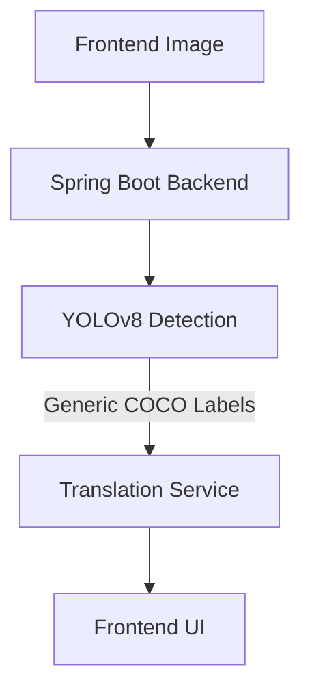
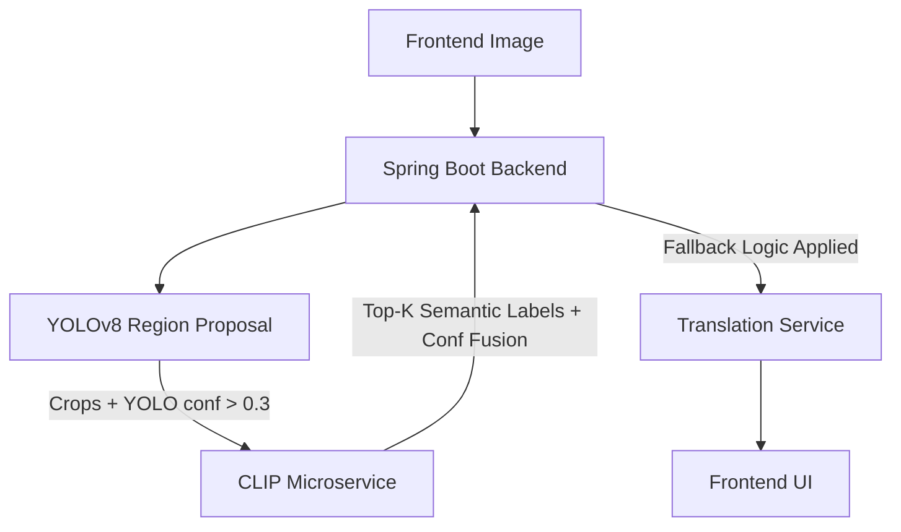

# AI Scanner Upgrade: YOLO + CLIP Hybrid Architecture

## 1. Architecture Overview (Before vs After)

### **Before: Single-Model Pipeline**

- **Limitation:** YOLOv8 (pretrained on COCO) acts as a generic bounding-box detector. It correctly finds an object (e.g., a "shoe") but provides no deeper semantic context.

### **After: Hybrid Semantic Pipeline**

- **Enhancement:** YOLO is now solely responsible for locating objects and extracting distortion-free crops. The CLIP microservice steps in to provide deep semantic matching against dynamic prompt templates.

## 2. Why YOLO Alone Failed
- **COCO Dataset Limitations:** The standard YOLO model only understands 80 generic classes. If you point it at a MacBook, it only knows "laptop". If you point it at a Nike Air Max, it only knows "shoe".
- **Lack of Semantic Understanding:** YOLO learns spatial features but not textual context. It cannot distinguish between a "running shoe" and a "leather boot"—they both match the spatial pattern of a "shoe".

## 3. Why CLIP Improves the System
- **Vision-Language Matching:** CLIP maps images and text into the same mathematical space. This allows us to feed it the crop of the shoe and ask, "Is this a sneaker, a boot, or high heels?"
- **Dynamic Prompt Engineering:** The `clip-service` dynamically expands YOLO's generic labels (e.g., "bottle" -> "water bottle", "thermos") and wraps them in prompts (`"a photo of a {}"`). This bridges the gap between generic detection and real-world product recognition.

## 4. Performance & Latency Trade-offs
- **Increased Latency:** Adding a heavy Transformer model (CLIP) to the pipeline inherently increases total request time (estimated +1000ms to +2500ms depending on hardware).
- **Optimizations Applied:** 
  - **Bounded Concurrency:** The Spring Boot backend uses `CompletableFuture` with a fixed thread pool to query the CLIP service for multiple crops *in parallel*.
  - **Strict Timeouts:** CLIP requests are bounded to a strict 8-second read timeout. If it fails, the pipeline immediately falls back to the YOLO label to guarantee a fast user response.
  - **Caching:** The `clip-service` utilizes LRU caching based on crop hashes. 

## 5. How to Run the Full System
1. Rebuild the Docker stack to initialize the new Python service:
   ```bash
   docker compose down
   docker compose up --build
   ```
2. The `clip-service` will expose its health check/docs on `http://localhost:8002/docs`.
3. Open the frontend (`http://localhost:5173`), upload a photo of a specific product (e.g., a branded shoe or water bottle), and observe the enriched semantic labels.
